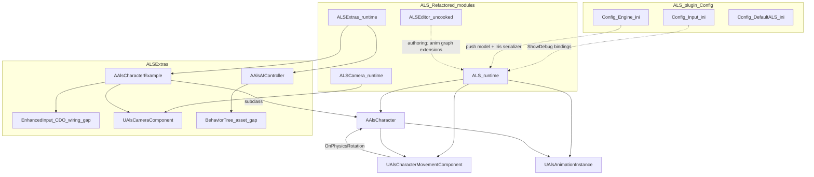

# ALS Refactored — System map (plugin scope)

**Scope:** This document describes **only** the Advanced Locomotion System Refactored plugin **checked in under this repository path** (`Plugins/ALS-Refactored`; all paths below are **relative to that folder**). Host game modules, root `Config/`, build scripts, and maps are **out of scope** unless noted as integration assumptions.

**Stealth / Echelon gameplay:** No bespoke stealth systems live in this plugin’s C++; those would be host-game concerns.

---

## Evidence legend

| Tag | Meaning |
|-----|---------|
| **Verified (plugin tree)** | Observable under this plugin folder (`.h/.cpp`, `Config/`, [`ALS.uplugin`](ALS.uplugin), [`README.md`](README.md)). [`Content/`](Content/) holds packaged `.uasset` / `.umap` files (**binaries on disk**): folder layout and filenames are observable; **graphs inside assets**, map wiring, and **World Partition** cells under `__ExternalActors__` / `__ExternalObjects__` are **not** readable as text here. |
| **Verified (upstream README)** | Stated in [`README.md`](README.md); upstream *intent*, not guaranteed by assets absent from your tree. |
| **Inferred (code)** | Deduction justified by cited sources. |
| **Gap** | Needs Unreal Editor, `.uasset` / `.umap`, or binaries not tracked as text here. |

---

## 1. One-paragraph overview

ALS Refactored provides a **Gameplay Tag–driven** third-person locomotion stack: **`AAlsCharacter`** coordinates tick-time refreshes (**view**, **locomotion**, **mantling / ragdoll / rolling**), **`UAlsCharacterMovementComponent`** extends UE movement with ALS-specific prediction fields and gait/rotation tags, **`UAlsAnimationInstance`** mirrors character state into animation/Control Rig consumers (including **worker-thread** update path), **`UAlsCameraComponent`** supplies a mesh-attached traced third-person camera, and **ALSExtras** ships **`AAlsCharacterExample`** (Enhanced Input sample) plus **`AAlsAIController`** (Behavior Tree runner). **`ALSEditor`** adds uncooked authoring helpers.

**Verified (plugin tree):** This checkout includes **`Content/`** with hundreds of Unreal assets (animations, input actions, audio, sample levels, AI blackboard/controller assets, etc.). **Gap:** Blueprint/AnimBP/Behavior Tree **graph logic** and Data Asset row semantics are still **Editor / manual inspection** tasks — agents should not invent node wiring from filenames alone.

---

## 2. Plugin identity & modules

**Verified:** [`ALS.uplugin`](ALS.uplugin) — `VersionName` **4.17**, `EngineVersion` **5.7.0**, `CanContainContent: true`.

| Module | Type | Role (summary) |
|--------|------|----------------|
| **ALS** | Runtime | Character, animation instance, movement, notifies, RigVM units, mantling RMS integration. Deps include `GameplayTags`, `ControlRig`, `RigVM`, `AnimGraphRuntime`; private `NetCore`, `PhysicsCore`, `Niagara` — [`Source/ALS/ALS.Build.cs`](Source/ALS/ALS.Build.cs). |
| **ALSCamera** | Runtime | Third-person pivot/lag/trace camera (`UAlsCameraComponent`). |
| **ALSExtras** | Runtime | Reference pawn + Enhanced Input hooks; AI controller shim. |
| **ALSEditor** | UncookedOnly | Animation graph/modifier/skeleton authoring utilities (`LoadingPhase: PreDefault` per [`ALS.uplugin`](ALS.uplugin)). |

**Enabled companion engine plugins** (names as declared under `Plugins` in [`ALS.uplugin`](ALS.uplugin)): ACLPlugin, AnimationModifierLibrary, ControlRig, EngineCameras, EnhancedInput, GameplayTagsEditor, Metasound, Niagara, PropertyAccessNode.

### 2.1 Packaged Unreal content (`Content/`)

**Verified (plugin tree — layout + examples, not inner graphs):**

| subtree | Examples (filenames only) |
|---------|---------------------------|
| `Content/ALS/` | Anim montages/blendspaces (`A_Als_*`, `BS_*`, `AM_*`), character data (`Data/Character/`, curves `CV_*`), input (`Data/Input/IA_Als_*`). |
| `Content/ALSExtras/` | Sample levels (**`Levels/L_Als_Playground.umap`**, **`Levels/L_Als_Grid.umap`**), meshes/audio, **`AI/AIC_Als.uasset`**, **`AI/BB_Als.uasset`**, Enhanced Input extras (`Data/Input/`). |
| `Content/ALSCamera/` | Camera blend curves (e.g. `Data/CF_Als_CameraBlend_Smooth.uasset`). |

World Partition external actor/object payload folders (`Content/__ExternalActors__`, `Content/__ExternalObjects__`) nest under **`ALSExtras/Levels/`** paths for those maps.

Navigation for agents: [`Content/AGENTS.md`](Content/AGENTS.md).

---

## 3. Plugin configuration (`Config/`)

Merged with the **host project** configs when the plugin is enabled — this section documents **ALS-owned files only**.

| File | Role |
|------|------|
| [`Config/Input.ini`](Config/Input.ini) | **Shift+0** → `ShowDebug` (generic). **Shift+1..8** → `ShowDebug` ALS channels (`Als.Curves`, `Als.State`, `Als.Shapes`, `Als.Traces`, `Als.Mantling`, `Als.CameraCurves`, `Als.CameraShapes`, `Als.CameraTraces`) — see file for the exact key→command map. |
| [`Config/Engine.ini`](Config/Engine.ini) | `net.IsPushModelEnabled=true`, `p.NetUsePackedMovementRPCs=true`, `a.URO.DisableInterpolation=True`; Iris **`SupportsStructNetSerializerList`** entry for **`AlsRootMotionSource_Mantling`**. |
| [`Config/DefaultALS.ini`](Config/DefaultALS.ini) | `CoreRedirects` for renamed ALS types/properties across versions. |

**Host-only:** Default maps, renderer, Common UI, and project-wide input axis boilerplate remain **outside** this folder — not documented here.

---

## 4. Core runtime: `AAlsCharacter`

### 4.1 Purpose

Central pawn authority: replicated **desired** tags (stance, gait, rotation mode, overlays, aiming, view mode), resolved **runtime** tags, **`FAlsLocomotionState`**, mantling/ragdoll/rolling substates, and **network-smoothed** view rotation.

### 4.2 Key artifacts

- [`Source/ALS/Public/AlsCharacter.h`](Source/ALS/Public/AlsCharacter.h)
- [`Source/ALS/Private/AlsCharacter.cpp`](Source/ALS/Private/AlsCharacter.cpp), [`Source/ALS/Private/AlsCharacter_Actions.cpp`](Source/ALS/Private/AlsCharacter_Actions.cpp)

### 4.3 Main state (representative)

| Bucket | Examples | Role |
|--------|-----------|------|
| Desired / replicated | `DesiredStance`, `DesiredGait`, `DesiredRotationMode`, `OverlayMode`, `ViewMode`, `bDesiredAiming` | Push-model replication (`COND_SkipOwner`). |
| Resolved | `LocomotionMode`, `RotationMode`, `Stance`, `Gait`, `LocomotionAction` | Drives animation + movement policy. |
| View | `ReplicatedViewRotation`, `ViewState` + `NetworkSmoothing` | View replication & proxy smoothing (`RefreshView*` / `RefreshViewNetworkSmoothing`). |
| Locomotion | `LocomotionState` (velocity, yaw angles, input) | Produced during `Tick` refresh pipeline. |

### 4.4 Lifecycle highlights

**Ctor:** substitutes `UAlsCharacterMovementComponent`, sets mesh/`VisibilityBasedAnimTickOption` defaults, disables controller rotation axes.

**`PostInitializeComponents`:** mesh ticks after actor (`AddTickPrerequisiteActor`); binds `AlsCharacterMovement->OnPhysicsRotation`; injects **`MovementSettings`**; caches **`UAlsAnimationInstance`**.

**`Tick` order (verified in `AlsCharacter.cpp`):**

`RefreshMovementBase` → `RefreshMeshProperties` → `RefreshInput` → `RefreshLocomotionEarly` → `RefreshView` → `RefreshLocomotion` / `RefreshGait` / `RefreshRotationMode` → grounded/air rotation helpers → **`AutoStartMantling`** → **`RefreshMantling` / `RefreshRagdolling` / `RefreshRolling`** → `Super::Tick` → **`RefreshLocomotionLate`**.

**`RefreshInput` (AutonomousProxy+):** `InputDirection` from acceleration/max acceleration → `LocomotionState.bHasInput` and planar input yaw (**bridges gameplay input → ALS locomotion animator**).

**Networking:** Proxies strip/reconcile replicated rotation expectations in `PostNetReceiveLocationAndRotation` / `OnRep_ReplicatedBasedMovement`; teleport detection calls `AnimationInstance->MarkTeleported()`. Mantling replication supported via Iris serializer registration in **`Config/Engine.ini`**.

### 4.5 Integrations

- Movement: gait/rotation tags, physics rotation delegate.
- Anim: pulls/pushes mirrored tags & transforms through `UAlsAnimationInstance`.
- Extras: `AAlsCharacterExample` overrides `CalcCamera`; AI uses same character base types.

---

## 5. Movement — `UAlsCharacterMovementComponent`

**Verified:** [`Source/ALS/Public/AlsCharacterMovementComponent.h`](Source/ALS/Public/AlsCharacterMovementComponent.h), `.cpp`.

- Disables UE orient-to-movement / rotation-rate defaults incompatible with ALS (see ctor + editor guards).
- **`FAlsSavedMove` / `FAlsCharacterNetworkMoveData`** extend prediction with **`RotationMode`**, **`Stance`**, **`MaxAllowedGait`**.
- **`ConsumeInputVector`**: `bInputBlocked` zeroes steering.
- **`bMovementModeLocked`** gates mode changes.
- **`OnPhysicsRotation`** multicast delegate subscribed by **`AAlsCharacter`**.
- Overrides walking/nav/custom physics paths with ALS gait refresh (`RefreshGroundedMovementSettings()` in walking path).

---

## 6. Animation — `UAlsAnimationInstance`

**Verified:** [`Source/ALS/Public/AlsAnimationInstance.h`](Source/ALS/Public/AlsAnimationInstance.h), `AlsAnimationInstance.cpp`.

- **`NativeUpdateAnimation`:** Copies character tags/state; refreshes movement base / view / locomotion / in-air / feet / ragdoll on game thread; teleport threshold vs `TeleportDistanceThreshold`.
- **`NativeThreadSafeUpdateAnimation`:** Parallel evaluation path (**also stated in README**).
- **`GetControlRigInput()`**: feeds Control Rig; graph wiring **Gap** without authored assets.

**Gameplay tags:** [`Source/ALS/Public/Utility/AlsGameplayTags.h`](Source/ALS/Public/Utility/AlsGameplayTags.h) declares view/locomotion/gait/stance/overlay/action tag namespaces used across C++ & content.

---

## 7. Environment traces (collision), not stealth AI

| Feature | Evidence | Notes |
|---------|----------|--------|
| Foot IK offset probe | [`Source/ALS/Public/Nodes/AlsRigUnit_FootOffsetTrace.h`](Source/ALS/Public/Nodes/AlsRigUnit_FootOffsetTrace.h) | Default `ECC_Visibility` is a **collision channel name**, not a light/stealth meter. |
| Mantling scans | [`Source/ALS/Private/AlsCharacter_Actions.cpp`](Source/ALS/Private/AlsCharacter_Actions.cpp) | Sweeps (`MantlingTraceChannel`), walkable checks, `UAlsRootMotionSource_Mantling`. |
| Camera geometry | [`Source/ALSCamera/Public/AlsCameraComponent.h`](Source/ALSCamera/Public/AlsCameraComponent.h) | Pull-back collision traces. |

**Not in ALS:** AISense perception, noise propagation graphs, luminance stealth meters.

---

## 8. Camera — `UAlsCameraComponent`

`USkeletalMeshComponent`-derived component: pivot lag, offsets, **`CalculateCameraTrace`**, FoV overrides, shoulder swap (**Verified:** header).

**ALSExtras wiring:** [`Source/ALSExtras/Private/AlsCharacterExample.cpp`](Source/ALSExtras/Private/AlsCharacterExample.cpp) activates `Camera->GetViewInfo` from `CalcCamera` when camera component is active.

---

## 9. Input sample — `AAlsCharacterExample`

**Verified:** [`Source/ALSExtras/Public/AlsCharacterExample.h`](Source/ALSExtras/Public/AlsCharacterExample.h), `.cpp`.

- Adds **`UEnhancedInputComponent`** binds for move/look/sprint/walk/crouch/jump/aim/ragdoll/roll/view/rotation shoulder.
- Registers **`InputMappingContext`** on `NotifyControllerChanged` via **`UEnhancedInputLocalPlayerSubsystem`**.
- **`Input_OnJump`:** `StopRagdolling` → `StartMantling` → uncrouch stance → `Jump()` priority order.

**Verified:** `UInputAction` / `UInputMappingContext` assets exist under this plugin (**e.g.** `Content/ALS/Data/Input/IA_Als_*.uasset`, `Content/ALSExtras/Data/Input/`). **Gap:** Which assets are wired on **`AAlsCharacterExample`** (or subclasses) lives in Blueprint/class defaults inside `.uasset` files — verify in Editor, do not infer from filenames alone.

---

## 10. AI sample — `AAlsAIController`

**Verified:** [`Source/ALSExtras/Private/AlsAIController.cpp`](Source/ALSExtras/Private/AlsAIController.cpp) — **`RunBehaviorTree(BehaviorTree)`** on possess; **`GetFocalPointOnActor`** favors pawn view location.

**Verified:** Companion assets exist under **`Content/ALSExtras/AI/`** (e.g. `AIC_Als.uasset`, `BB_Als.uasset`). **Gap:** **`UBehaviorTree` graph** assigned on the controller + blackboard key semantics are **binary** — open in Editor; do not infer from filenames.

---

## 11. Editor module (`ALSEditor`)

Uncooked toolchain: Rig/Anim graph authoring extensions (modifiers, skeletal utilities, **`AlsAnimGraphNode_*`** in editor module). Inspect headers under [`Source/ALSEditor/Public`](Source/ALSEditor/Public).

---

## 12. Footstep/audio/VFX hooks (notify)

**Verified:** [`Source/ALS/Public/Notifies/AlsAnimNotify_FootstepEffects.h`](Source/ALS/Public/Notifies/AlsAnimNotify_FootstepEffects.h) — configures optional **`USoundBase`**, Niagara, decals; **spawn-at-hit** semantics — **not** a full occlusion/propagation model.

**Host:** Project-wide spatialization/audio plugins belong to **host config** — out of plugin scope unless ALS references them explicitly.

---

## 13. Data-driven tuning pattern

Designer-facing **`U*Settings`** objects (`Source/ALS/Public/Settings/`) referenced from **`AAlsCharacter`** / **`UAlsAnimationInstance`** — authored as assets in content; **CSV DataTable** patterns are optional host patterns, not ALS core.

---

## 14. How to rebuild ALS-style integration (from scratch)

1. Match engine line to **`ALS.uplugin` `EngineVersion`** (or upstream release notes).
2. Enable the engine plugins listed under **`Plugins`** in [`ALS.uplugin`](ALS.uplugin) (for example EnhancedInput, ControlRig, Niagara). **`GameplayTags` support here is via the ALS module dependency** in [`Source/ALS/ALS.Build.cs`](Source/ALS/ALS.Build.cs), not a separate entry in that `Plugins` list.
3. Subclass **`AAlsCharacter`** or use **`AAlsCharacterExample`** as a template.
4. Author ALS-compatible skeleton (README: scripted skeleton action), linked animation layers / Control Rig per upstream guidance.
5. Keep **`Plugins/ALS-Refactored/Config/Engine.ini`** behaviors in mind if replicating networked mantling + push model.

Detailed AnimBP/Rig graphs: **Gap** here.

---

## 15. Subsystem interaction diagram (plugin internals)

---

## 16. Evidence gap register (within plugin responsibility)

Inspect in Editor when migrating or debugging:

1. **AnimBP / Control Rig graphs** referencing `UAlsAnimationInstance`, linked layering, IK targets — filenames exist under `Content/ALS/` but **graphs require Editor**.
2. **AI Behavior Tree + Blackboard graphs** wired to **`AIC_Als` / `BB_Als`** (`Content/ALSExtras/AI/`).
3. **`DefaultObject` tweaks** on `UAlsCharacterSettings` / `UAlsMovementSettings` / animation settings assets.
4. Layered AnimBP linkage to **`UAlsLinkedAnimationInstance`** (if using linked graphs per README).

---

## 17. References

- Upstream repository: <https://github.com/Sixze/ALS-Refactored>
- Marketplace / Fab listing referenced in [`ALS.uplugin`](ALS.uplugin) `MarketplaceURL`

---

_Plugin-scope map; textual sources only._
